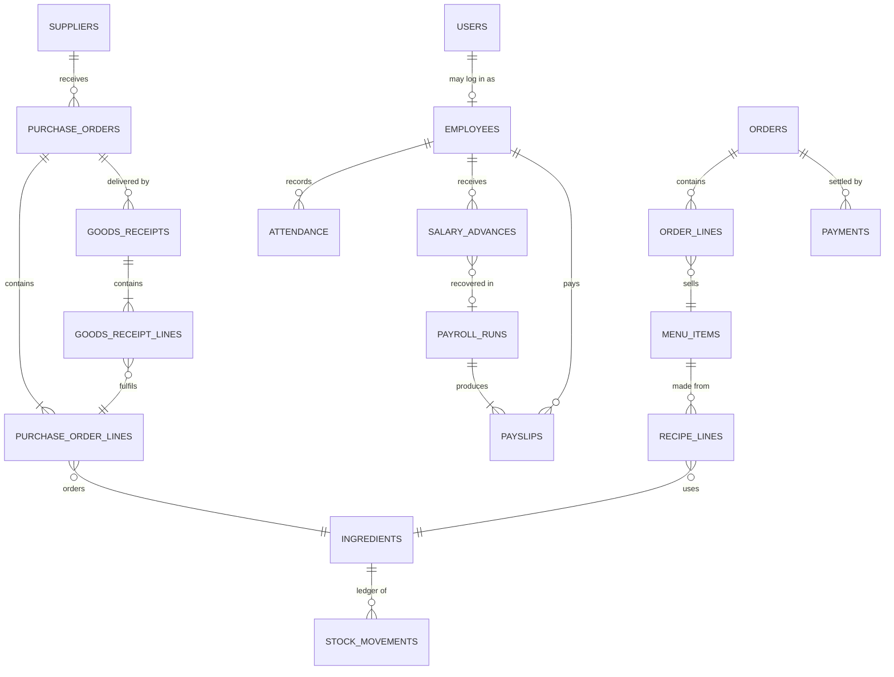

# 3. Data model

## Conventions
- Primary keys are integer surrogates; business identifiers (`sku`, `code`, `number`,
  `employee_code`, `email`) carry unique indexes.
- Money columns end in `_minor` and are integers in the currency's minor unit.
- Quantities are floats in the ingredient's unit; a recipe for 1 portion of biryani might use
  `0.2 kg` rice and `8 g` garam masala.
- Enumerations are stored as strings (`StrEnum`) so the database stays readable.
- `created_at` / `updated_at` are maintained by `TimestampMixin`.

## Table notes

| Table | Notes |
|-------|-------|
| `ingredients` | `quantity_on_hand` and `avg_cost_minor` are denormalised from `stock_movements` for fast reads. |
| `stock_movements` | Append-only. `reference_type`/`reference_id` point at the goods receipt or order that caused it. Signed `quantity`. |
| `purchase_order_lines` | `received_quantity` accumulates across receipts; `outstanding_quantity` is derived. |
| `order_lines` | `unit_price_minor` is copied from the menu at sale time (price history is preserved). |
| `attendance` | Unique on (`employee_id`, `work_date`). |
| `salary_advances` | `recovered_in_run_id` is NULL until a finalized run recovers it. |
| `payroll_runs` | Unique on (`period_year`, `period_month`). |
| `payslips` | Unique on (`run_id`, `employee_id`); all computed columns are persisted so a finalized run is a frozen record. |
